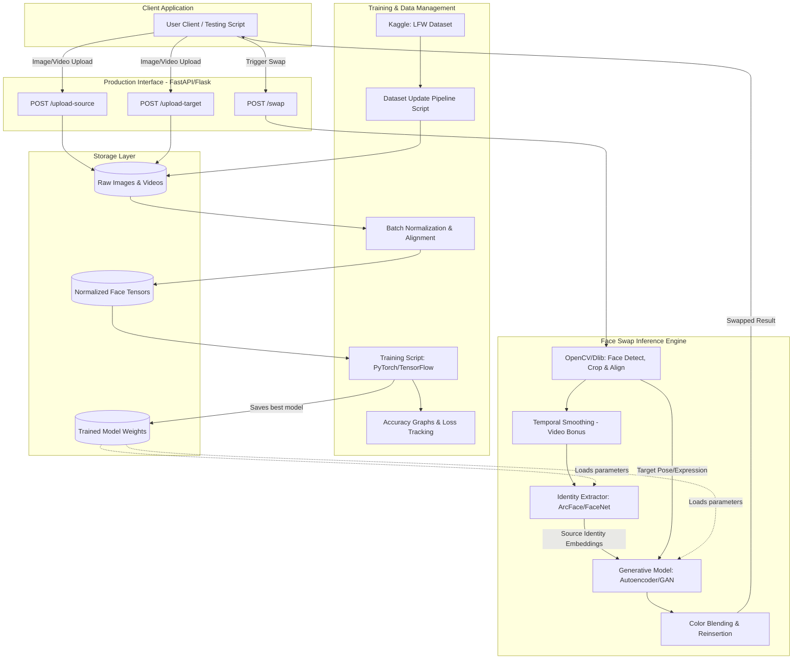

Here is a high-level architectural diagram formatted as a Mermaid script, specifically tailored to the LexisNexis IDVerse face swap assessment requirements you received.

This diagram breaks down the system into the production-ready API interface, the machine learning inference engine, the data pipeline, and the storage layer as requested in the assessment parameters.

### High-Level Architecture: Face Swap System

---

### Component Breakdown

* 
**Production Interface:** This section fulfills the requirement to create a production-ready interface script. It abstracts the backend REST endpoints that handle the ingestion of media and trigger the processing loop.

* **Face Swap Inference Engine:** This is the core application logic. It maps out the flow from initial face detection (using OpenCV/Dlib) to the deep learning generation. I have included a "Temporal Smoothing" node to account for the bonus requirement to ensure smooth transitions on video frames.

* 
**Training & Data Management:** This maps to the requirements for the Python training script, the dataset update method, and the generation of accuracy graphs.

* 
**Storage Layer:** Represents the physical or cloud-based directory structure required to hold the Labeled Faces in the Wild (LFW) dataset  and the serialized model weights (e.g., `.pt` or `.h5` files) used by the inference engine.